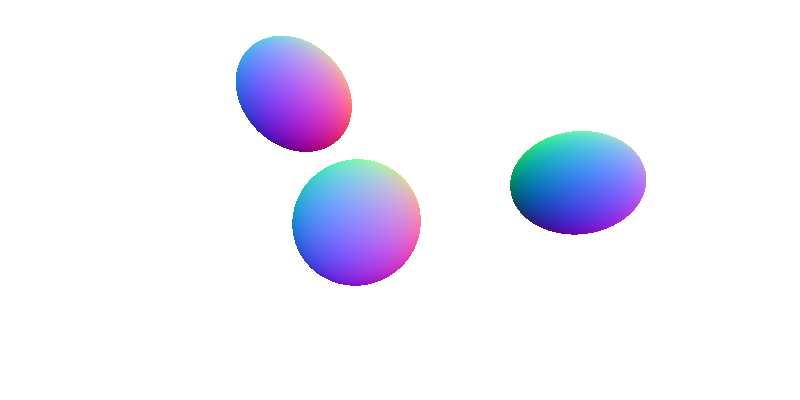

# Learning C++ — Mini Raytracer

A small raytracer written from scratch in C++17 as a hands-on way to learn the language.
It renders spheres shaded by their surface normals and writes the result as a plain-text
PPM image, with no external libraries.

The project was built step by step alongside a structured curriculum. Each module adds
a C++ concept to the codebase, coming from a C# / Python background, with a focus on
the memory model: stack vs heap, ownership, RAII and move semantics.

The curriculum was taught by an AI tutor (Claude). It introduced each concept, set the
coding task and critiqued my implementation, but I wrote the code myself.

This is also some of my first experience using Claude Code, if I were to do something similar after my learnings from this exercise, my CLAUDE.md would look a lot different.

## Output

An 800×400 image of three spheres. Each pixel's colour is mapped from the surface
normal at the hit point, and anything that misses is drawn as a white background.

## Building & Running

Requires a C++17 compiler (g++ or clang++).

    g++ -std=c++17 -Wall -Wextra -o raytracer main.cpp
    ./raytracer > image.ppm

Open `image.ppm` in any viewer that supports PPM (e.g. GIMP, IrfanView, or an online
PPM viewer).

## Project Structure

| File          | Purpose |
|---------------|---------|
| `vec.h`       | `Vec3<T>` template with operator overloading, `dot`, `normalise`, `reflect`; `Vec3d` alias |
| `ray.h`       | `Ray` class: origin + direction, private members with const getters |
| `hittable.h`  | Abstract base class with a pure virtual `hit()` and a virtual destructor |
| `sphere.h`    | `Sphere` derives from `Hittable` and implements ray–sphere intersection |
| `hitrecord.h` | `HitRecord` struct: hit point, surface normal, and distance `t` |
| `main.cpp`    | Scene setup, closest-hit search, and the per-pixel render loop |

## How It Works

1. A camera at the origin fires one ray per pixel through a virtual viewport.
2. Every object in a `std::vector<std::unique_ptr<Hittable>>` is tested against the ray.
3. `hit()` returns `std::optional<HitRecord>`, either a hit or `std::nullopt` for a miss.
4. The closest hit (smallest `t`) is kept, and its normal is mapped to an RGB colour.
5. Pixels are streamed to stdout in PPM `P3` format.

## Curriculum

| Module | Topic | Key Concepts | Status |
|--------|-------|--------------|--------|
| 0 | Toolchain setup | g++/clang++, compile pipeline | ✅ |
| 1 | First program | Types, functions, headers, compilation | ✅ |
| 2 | Memory model & structs | Stack vs heap, `sizeof`, operator overloading | ✅ |
| 3 | Pointers & references | Raw pointers, `&`, pass-by-value vs ref vs pointer | ✅ |
| 4 | Classes & destructors | Constructors, destructors, const correctness | ✅ |
| 5 | RAII & smart pointers | `unique_ptr`, `shared_ptr`, ownership | ✅ |
| 6 | Polymorphism | `virtual`, vtables, abstract base classes | ✅ |
| 7 | Templates | Compile-time generics vs C# runtime generics | ✅ |
| 8 | Move semantics | Rule of Five, rvalue refs, `std::move` | ✅ |
| 9 | STL & modern C++ | `vector`, `optional` (`variant` and algorithms not covered) | 🚧 Partial |

## Key Takeaways

- `unique_ptr`'s copy constructor is explicitly deleted, so ownership can only be moved.
- A base class needs a virtual destructor when objects are deleted through a base pointer.
- `override` catches signature mismatches at compile time.
- Most vexing parse: `Ray ray();` declares a function, not a variable.
- C++ templates generate separate code per type at compile time; C# generics are
  resolved at runtime.
- Prefer `using` aliases over `typedef`.
- Move semantics only pay off for types that own resources; for `Vec3`, a move is the
  same as a copy.
- Declaring a move constructor implicitly deletes the copy constructor.
